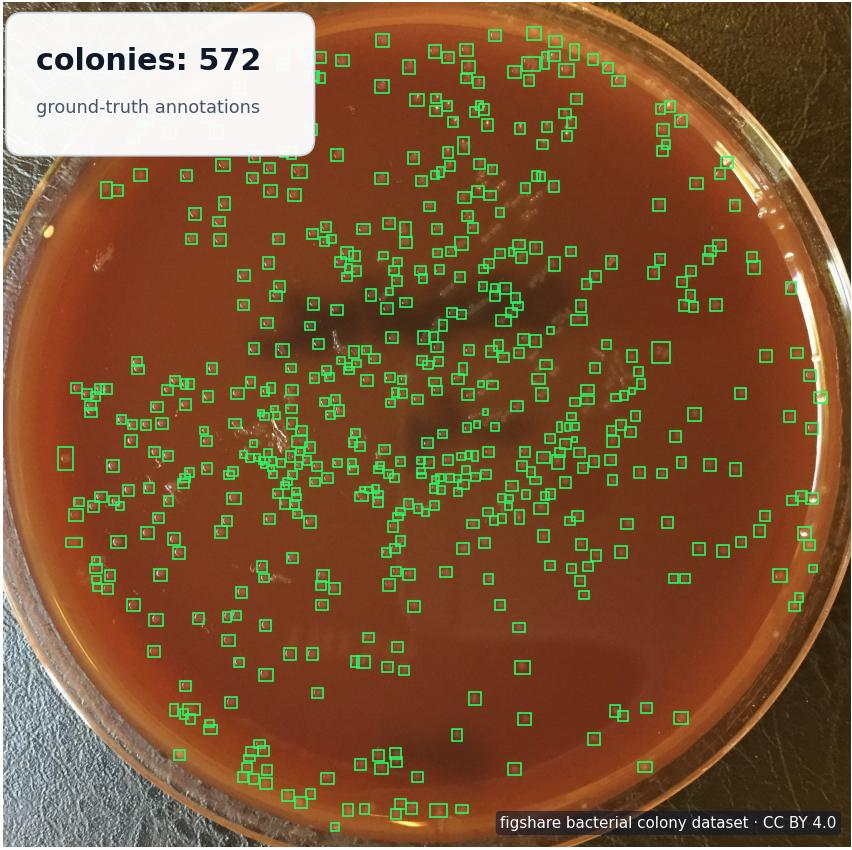

# Colony Counting


A computer-vision project for **counting bacterial colonies from Petri-dish images**. It combines YOLO-style object detection with **tiled ONNX inference** and lightweight geometric post-processing to produce both a per-image colony count and annotated images for visual review.



> Real Petri-dish image from the [bacterial colony dataset](https://figshare.com/articles/dataset/Annotated_dataset_for_deep-learning-based_bacterial_colony_detection/22022540)
> (figshare, CC BY 4.0), shown with the dataset's ground-truth colony annotations and total count.

## Features

- 🧫 Converts bbox annotations into YOLO detection datasets (full-image and tiled).
- 🔍 Tiled inference preserves small-colony detail in dense regions.
- 🧹 Post-processing: per-tile IoU NMS, global coordinate restoration, dish-circle filtering, and containment-based duplicate removal.
- 📄 Exports `results.csv` and annotated images for manual review.
- ⚡ Runs on the ONNX Runtime **CPU** provider — no CUDA required.

## Results

On the held-out validation split used during development, the selected tiled pipeline reached:

| MAE | MAPE | Bias | Notes |
| ---: | ---: | ---: | --- |
| **3.616** | **3.077%** | +1.041 | Tiled ONNX inference with circle filtering and containment merge |

> A development benchmark only. Re-validate on new data — microscopy setup, lighting, colony
> type, and plate placement all change the error profile.

## Pipeline


```text
image
  → overlapping tiles            (keep local resolution for small colonies)
  → ONNX detector per tile       (CPU runtime)
  → per-tile IoU NMS             (remove local duplicates)
  → restore global coordinates   (back to original image space)
  → dish-circle filter           (drop boxes outside the plate)
  → containment-based merge      (remove cross-tile duplicates)
  → count CSV + annotated images
```

Tiling improves small-object recall but creates boundary duplicates, so global coordinate
restoration and containment-based de-duplication run after per-tile inference. Final model
selection is based on count metrics (MAE, MAPE, Bias), not on the merge step itself.

## Project Structure

```text
Colony_counting/
├── app/                # standalone ONNX inference entry point (infer.py)
├── scripts/            # dataset conversion, evaluation, tuning, visualization
├── docs/               # method design, experiment summary, failure cases
├── assets/             # README images and diagrams
├── models/             # local weight notes / placeholders (git-ignored binaries)
├── data/               # local datasets (git-ignored)
├── tests/              # import / smoke tests
└── pyproject.toml
```

Large data, trained weights, and experiment outputs are intentionally kept out of git. See
`models/README.md` and `data/README.md` for the expected local layout.

## Quick Start

```bash
git clone https://github.com/xieyaozong/Colony_counting.git
cd Colony_counting
python -m venv .venv
```

Activate the environment:

```powershell
.\.venv\Scripts\Activate.ps1     # Windows PowerShell
```

```bash
source .venv/bin/activate         # Linux / macOS
```

Install and run:

```bash
python -m pip install -U pip
python -m pip install -e .

# place an ONNX model at app/models/best.onnx and images under app/data/
python app/infer.py --input app/data --output app/outputs --model app/models/best.onnx
```

Outputs: `app/outputs/results.csv` and `app/outputs/images/`.

## Model Weights

Trained weights / ONNX files are not committed (size + redistribution). Place your model at
`app/models/best.onnx`. If a demo weight is published later, prefer **GitHub Releases** over
committing large binaries.

## Training & Evaluation

```text
scripts/prepare_yolo_dataset.py        scripts/evaluate_count_mae.py
scripts/prepare_tiled_yolo_dataset.py  scripts/evaluate_tiled_count_mae.py
scripts/sweep_tiled_count_thresholds.py  scripts/visualize_count_results.py
```

See [scripts/README.md](scripts/README.md) and [docs/experiment_summary.md](docs/experiment_summary.md).

## Limitations

- The benchmark reflects the development validation split; re-validate on new conditions.
- Very dense or strongly overlapping colonies may still be under-counted.
- Bounding-box detection can be less suitable than segmentation for heavy overlap.
- The public repository does not include trained weights or raw datasets.

## Dataset & License

The detector was developed and trained on the **[Annotated dataset for deep-learning-based
bacterial colony detection](https://figshare.com/articles/dataset/Annotated_dataset_for_deep-learning-based_bacterial_colony_detection/22022540)**
(figshare, **CC BY 4.0**). The full dataset (raw images and annotations) is **not** redistributed
here — download it from figshare and follow its license. The README preview images
(`assets/example_prediction.jpg`, `assets/pipeline_overview.png`) are derived from that dataset
under CC BY 4.0 with attribution.

Project **code** is released under the [MIT License](LICENSE). Re-check dataset and model-weight
redistribution terms before publishing derived weights.
