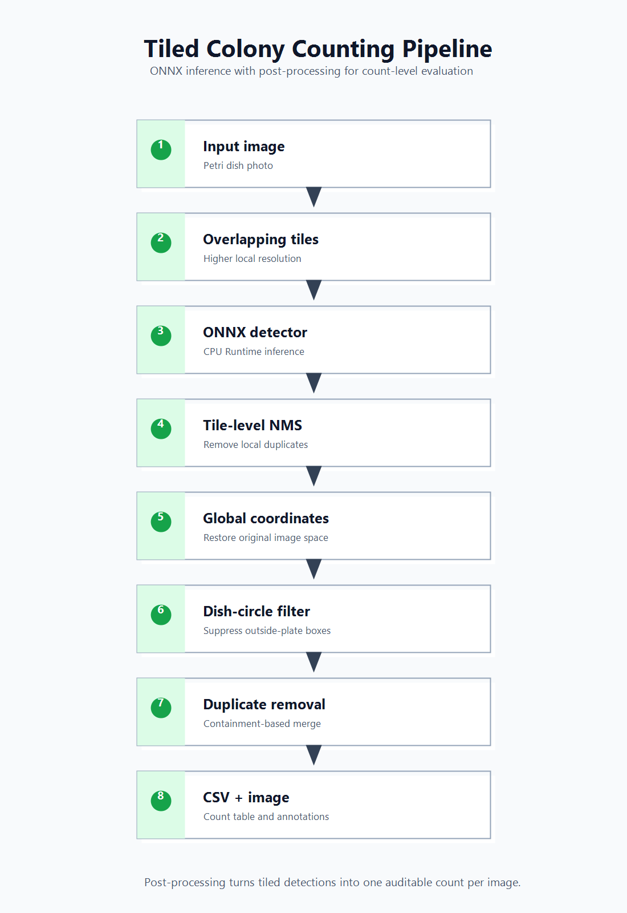

# Method Design

## Goal

The project estimates bacterial colony counts from Petri dish images and exports
annotated images for visual inspection. The count is produced from detected
bounding boxes instead of direct regression so that each predicted colony can be
reviewed.

## Inference Pipeline



```text
input image
  -> overlapping tiles
  -> ONNX detector
  -> tile-level NMS
  -> global coordinate restoration
  -> dish-circle filtering
  -> containment-based duplicate removal
  -> count CSV and annotated image
```

## Why Detection Instead of Count Regression?

Direct regression can predict a count, but it does not show which visual objects
contributed to that number. Detection produces reviewable boxes, which is useful
for debugging false positives, missed dense regions, and edge-of-dish errors.

## Why Tiled Inference?

Colony images often contain many small objects. If the full image is resized into
a single detector input, small colonies can lose detail. Tiling keeps higher
local resolution by evaluating overlapping crops.

The tradeoff is that the same colony can appear in multiple tiles. The pipeline
therefore restores every tile prediction to original image coordinates and then
applies a global duplicate-removal step before counting.

## Post-processing Stages

| Stage | Purpose |
| --- | --- |
| Tile-level NMS | Removes duplicate boxes inside each tile |
| Global coordinate restoration | Converts tile-local boxes back to the original image |
| Dish-circle filtering | Removes detections whose centers are outside the Petri dish |
| Containment-based duplicate removal | Reduces overlapping-tile duplicates before counting |

## Model Selection

The final pipeline is selected by count-level metrics such as MAE, MAPE, and
Bias, not by the post-processing rule itself. The containment merge is an
inference rule that changes predicted counts; it is not an evaluation metric.
